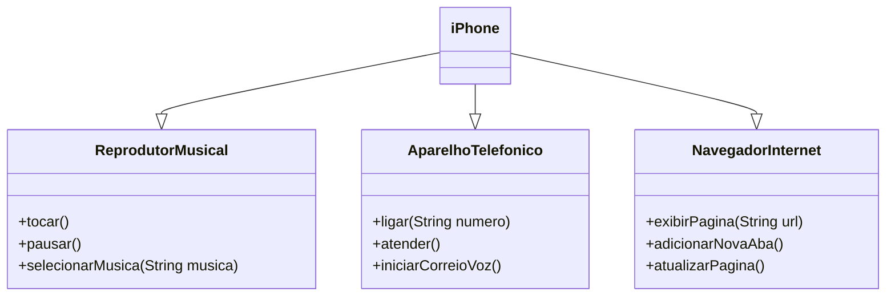

# modelagemiPhone

Este é um projeto da DIO, em que eu devo fazer um diagrama UML sobre o iPhone em sua primeira apresentação em 2007, utilizando os conhecimentos de Programação Orientada a Objetos,
aplicando conceitos de Classe e Interface, onde a Classe iPhone implementa as interfaces AparelhoTelefonico, NavegadorInternet e ReprodutorMusical.
Tudo isso foi aprendido utilizando a linguagem Java

## Diagrama UML utilizando o Mermaid

